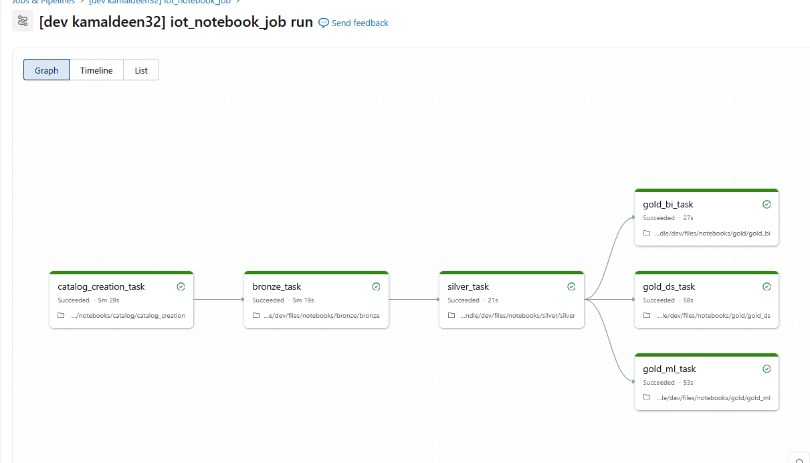
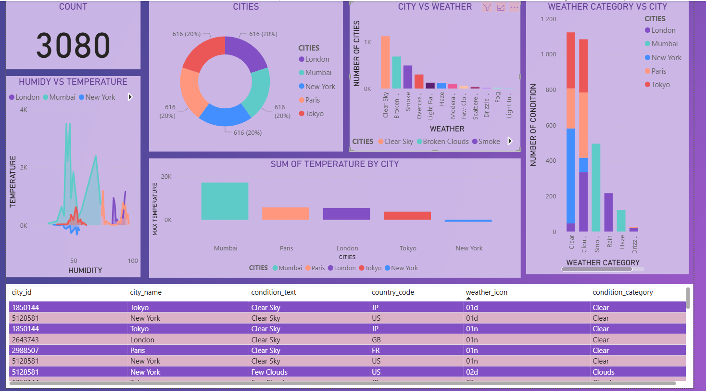

# weather_iot_bundle

A comprehensive data pipeline for ingesting, transforming, and analyzing weather IoT sensor data using Databricks. This project implements a medallion architecture (bronze, silver, gold layers) to process raw weather data from IoT devices, enrich it with temporal context, and provide both business intelligence and data science ready datasets.

## Project Structure

* `src/`: Python source code for this project.
  * `src/weather_iot_bundle_etl/`: Core ETL transformation logic.
  * `src/day_time/`: Utilities for daytime calculations and flagging.
  * `src/local_time/`: Utilities for timezone and local time handling.
* `dlt_etl/`: Databricks Lakehouse Tables ETL pipelines.
  * `bronze/`: Raw data ingestion from IoT sources.
  * `silver/`: Cleaned and enriched data transformations.
  * `gold/`: Analysis-ready datasets for BI, data science, and ML.
* `resources/`: Databricks resource configurations (jobs, pipelines).
* `tests/`: Unit tests for utilities and transformations.

## Architecture

The weather IoT data pipeline follows a medallion architecture pattern:

```
IoT Devices -> S3 Bucket -> Bronze Layer -> Silver Layer -> Gold Layer
                (Raw Data)  (Ingestion)  (Transformation) (Analytics Ready)
```

**Data Flow:**

1. **IoT Devices**: Weather sensors collect temperature, humidity, pressure, and other metrics
2. **S3 Bucket**: Raw data files are uploaded from IoT devices to AWS S3
3. **Bronze Layer**: Databricks ingests raw data from S3, storing it as-is with minimal transformation
4. **Silver Layer**: Data is cleaned, validated, deduplicated, and enriched with temporal context (daytime flags, local timezone adjustments)
5. **Gold Layer**: Analysis-ready datasets are created for:
   - Business Intelligence (BI dashboards and reporting)
   - Data Science (feature engineering and model training)
   - Machine Learning (predictions and anomaly detection)

## Getting started

Choose how you want to work on this project:

(a) Directly in your Databricks workspace, see
    https://docs.databricks.com/dev-tools/bundles/workspace.

(b) Locally with an IDE like Cursor or VS Code, see
    https://docs.databricks.com/dev-tools/vscode-ext.html.

(c) With command line tools, see https://docs.databricks.com/dev-tools/cli/databricks-cli.html

If you're developing with an IDE, dependencies for this project should be installed using uv:

*  Make sure you have the UV package manager installed.
   It's an alternative to tools like pip: https://docs.astral.sh/uv/getting-started/installation/.
*  Run `uv sync --dev` to install the project's dependencies.


# Using this project using the CLI

The Databricks workspace and IDE extensions provide a graphical interface for working
with this project. It's also possible to interact with it directly using the CLI:

1. Authenticate to your Databricks workspace, if you have not done so already:
    ```
    $ databricks configure
    ```

2. To deploy a development copy of this project, type:
    ```
    $ databricks bundle deploy --target dev
    ```
    (Note that "dev" is the default target, so the `--target` parameter
    is optional here.)

    This deploys everything that's defined for this project.
    For example, the default template would deploy a pipeline called
    `[dev yourname] weather_iot_bundle_etl` to your workspace.
    You can find that resource by opening your workpace and clicking on **Jobs & Pipelines**.

3. Similarly, to deploy a production copy, type:
   ```
   $ databricks bundle deploy --target prod
   ```
   Note the default template has a includes a job that runs the pipeline every day
   (defined in resources/sample_job.job.yml). The schedule
   is paused when deploying in development mode (see
   https://docs.databricks.com/dev-tools/bundles/deployment-modes.html).

4. To run a job or pipeline, use the "run" command:
   ```
   $ databricks bundle run
   ```

5. Finally, to run tests locally, use `pytest`:
   ```
   $ uv run pytest
   ```

## Pipeline Workflow

The weather IoT pipeline executes the following tasks in sequence:

1. **catalog_creation_task**: Sets up the Databricks catalog and schemas for data storage
2. **bronze_task**: Ingests raw IoT data from S3 into the bronze layer (raw data zone)
3. **silver_task**: Cleans, validates, and enriches the data with temporal context
4. **gold_bi_task**: Creates BI-optimized datasets for dashboards and reporting
5. **gold_ds_task**: Prepares data science features for analysis and model training
6. **gold_ml_task**: Generates ML-ready datasets with engineering features

The gold layer tasks run in parallel after the silver layer completes, allowing multiple downstream consumers to work simultaneously.



## Dashboard

The project includes a dashboard demonstrating BI visualizations and a table of aggregated weather observations. The screenshot below shows sample charts (city counts, temperature sums, humidity vs temperature) and a preview table of city weather records.



